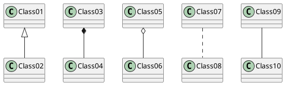

# Render PlantUML diagram in readme

Place README.md in src/ directory and add gen.sh file containing folowing code in root fo your repo: 
```bash
#!/usr/bin/env bash
python3 <(curl -s -L https://git.io/JTHXw)
```

Put our PlantUML diagrams in README file: 



You can use InteliJ plugin and it will render diagram four you during development. 

Then run: 

```
./gen.sh
```

It will analyze your `src/README.md` file and genearete `README.md` in root of the project. 
