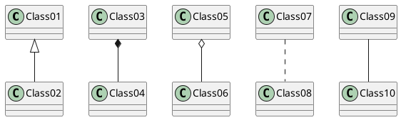

# Render PlantUML diagram in readme

Place README.md in resources/ directory and add gen.sh file containing folowing code in root fo your repo: 
```bash
#!/usr/bin/env bash
plant_uml="$(mktemp).jar"
curl -o $plant_uml -k -s -L https://raw.githubusercontent.com/alpha-prosoft/alpha-readme-gen/master/plantuml.jar
python3 <(curl -s -L https://raw.githubusercontent.com/alpha-prosoft/alpha-readme-gen/master/plant-uml-render.py) $plant_uml```
```

Put our PlantUML diagrams in README file: 

```
    ```puml
    @startuml
    Class01 <|-- Class02
    Class03 *-- Class04
    Class05 o-- Class06
    Class07 .. Class08
    Class09 -- Class10
    @enduml
    ```
```

Will genereate:




You can use InteliJ plugin and it will render diagram four you during development. 

Then run: 

```
./gen.sh
```

It will analyze your `src/README.md` file and genearete `README.md` in root of the project. 
