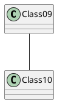

# Render PlantUML diagram in readme

Place README.md in resources/ directory and add gen.sh file containing folowing code in root fo your repo: 
```bash
#!/usr/bin/env bash
plant_uml="$(mktemp).jar"
curl -o $plant_uml -k -s -L https://raw.githubusercontent.com/alpha-prosoft/alpha-readme-gen/master/plantuml.jar
python3 <(curl -s -L https://raw.githubusercontent.com/alpha-prosoft/alpha-readme-gen/master/plant-uml-render.py) $plant_uml```
```

Put our PlantUML diagrams in README file: 

```
    ```puml
    @startuml
    Class09 -- Class10
    @enduml
    ```
```

Will genereate:




You can use InteliJ plugin and it will render diagram four you during development. 

Then run: 

```
./gen.sh
```
# Requirements for ubuntu
```
sudo apt-get install openjdk-17-jdk (Actually any JDK will do=
sudo apt install graphviz
sudo mkdir -p /opt/local/bin
sudo ln -s /usr/bin/dot /opt/local/bin/dot

```
It will analyze files in src/*.md and generate files on root with svg rendered
diagrams
